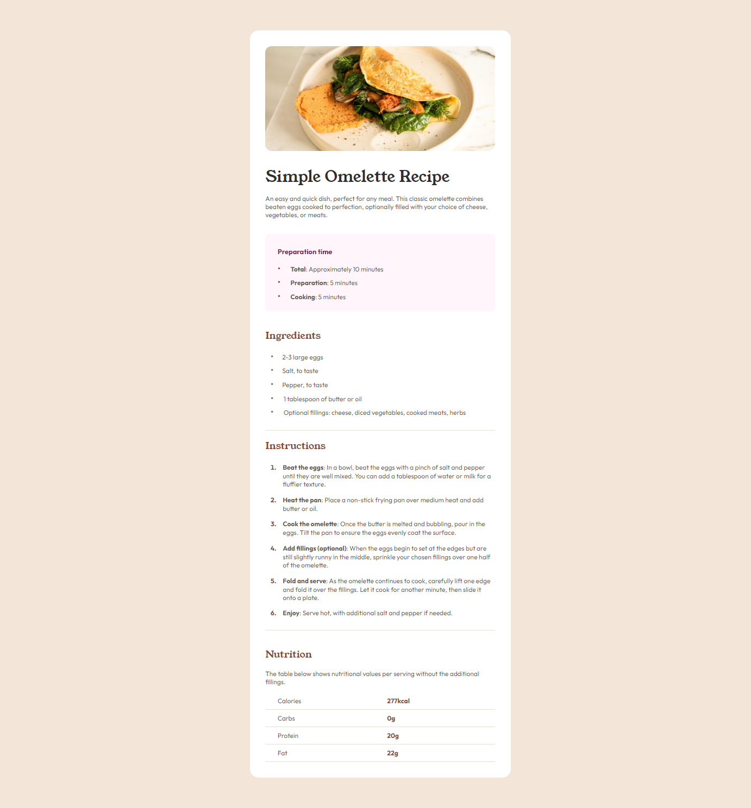

# Frontend Mentor - Recipe page solution

This is a solution to the [Recipe page challenge on Frontend Mentor](https://www.frontendmentor.io/challenges/recipe-page-KiTsR8QQKm). Frontend Mentor challenges help you improve your coding skills by building realistic projects.

## Table of contents

- [Overview](#overview)
  - [Screenshot](#screenshot)
  - [Links](#links)
- [My process](#my-process)
  - [Built with](#built-with)
  - [What I learned](#what-i-learned)
- [Author](#author)

## Overview

Building a recipe page using the design file, for desktop and mobile view.

### Screenshot

### Links

[Solution URL](https://github.com/Antonvasilache/recipe-page)
[Live Site URL](https://recipe-page-av.netlify.app/)

## My process

1. Writing down the HTML structure and placing the content inside.
2. Grouping the content into flex containers.
3. Adding margins, padding, border radius.
4. Adding fonts and colors.
5. Formatting the lists to match the design photo.
6. Adjusting the spacing as per the design.
7. Creating the nutrition table using CSS Grid.
8. Adding media queries for mobile devices/

### Built with

- Semantic HTML5 markup
- CSS custom properties
- Flexbox
- CSS Grid

### What I learned

- Using semantic HTML elements
- Formatting lists with custom types and spacings.
- Creating a table with CSS Grid.
- Using media queries for mobile devies

## Author

- Website - [Antonvasilache.com](https://www.antonvasilache.com)
- Frontend Mentor - [@Antonvasilache](https://www.frontendmentor.io/profile/Antonvasilache)
